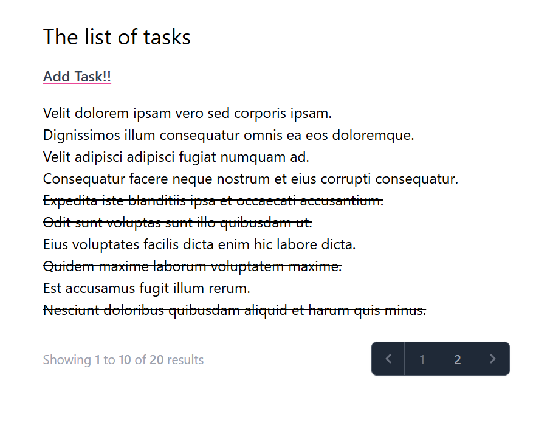
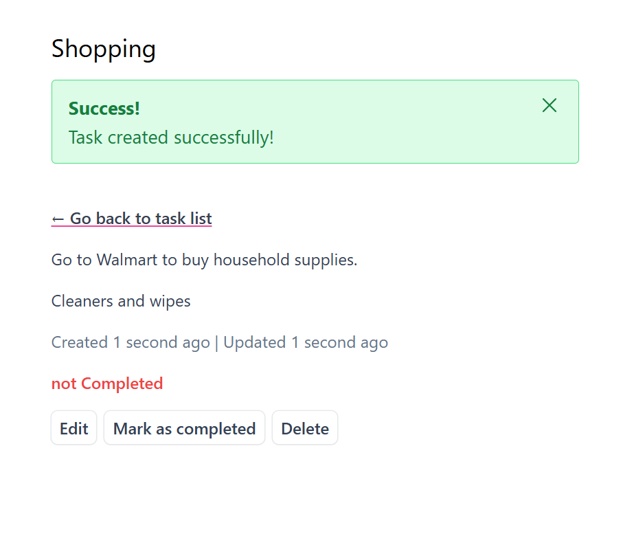

# Task List Application

This is a simple Task List application built with Laravel. It allows users to manage their tasks efficiently, offering features like task completion, editing, deletion, and validation.

## Features

- **View Tasks**: Display a paginated list of tasks stored in the database.
- **Task Details**: Access detailed information for each task.
- **Task Completion**: Mark tasks as completed or uncompleted with a single click.
- **Flash Messages**: Show quick, one-time messages (e.g., success notifications) that disappear upon refreshing the page or navigating away. Optionally, these messages can be manually dismissed.
- **Task Management**: 
  - Add new tasks using a secure, validated form.
  - Edit existing tasks with real-time feedback on validation errors.
  - Delete tasks from the database.
- **Input Validation**: Ensure user inputs are safe and display appropriate error messages for invalid inputs.

## Technologies Used

- **Laravel**: Backend framework for handling routes, database operations, and application logic.
- **MySQL**: Database to store task information.
- **JavaScript**: For interactive elements like flash message dismissal.
- **Bootstrap** (or any other CSS framework if applicable): For responsive UI design.

## How to Run the Project

1. Clone the repository:
   ```bash
   git clone https://https://github.com/Jaafar-Wannous/Task-List.git
   cd task-list
   ```

2. Install dependencies:
   ```bash
   composer install
   ```

3. Set up your environment:
   - Copy the `.env.example` file to `.env`:
     ```bash
     cp .env.example .env
     ```
   - Configure your database settings in the `.env` file.

4. Generate the application key:
   ```bash
   php artisan key:generate
   ```

5. Run database migrations:
   ```bash
   php artisan migrate
   ```

6. Serve the application locally:
   ```bash
   php artisan serve
   ```
   Access the application at `http://localhost:8000`.

## Screenshots

### Task List


### Flash Message


## Future Improvements

- Add user authentication for task ownership.
- Enhance UI with additional features such as task prioritization or category assignment.

## Contributing

Contributions are welcome! Feel free to submit a pull request or create an issue for any bugs or feature requests.

## License

This project is licensed under the [MIT License](LICENSE).

---
Enjoy managing your tasks with this Laravel application!
